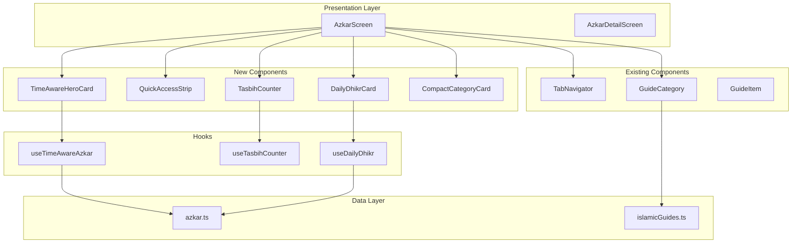

# Design Document: AzkarScreen Redesign

## Overview

The AzkarScreen redesign transforms the main Azkar tab into a more engaging and visually appealing experience. The design introduces a time-aware hero section, quick access navigation, an interactive tasbih counter, and improved visual hierarchy while maintaining the existing functionality for azkar categories and Islamic guides.

## Architecture



## Components and Interfaces

### New Components

#### TimeAwareHeroCard
Displays Morning or Evening azkar based on current time.

```typescript
// components/TimeAwareHeroCard.tsx

interface TimeAwareHeroCardProps {
  onPress: () => void;
}

// Features:
// - Automatically switches between morning/evening based on time
// - Gradient background (emerald to teal)
// - Shows category icon, title, description
// - Displays adhkar count and estimated duration
// - "Start Now" CTA button
```

#### QuickAccessStrip
Horizontal scrollable row of category shortcuts.

```typescript
// components/QuickAccessStrip.tsx

interface QuickAccessStripProps {
  categories: AzkarCategory[];
  onCategoryPress: (category: AzkarCategory) => void;
}

// Features:
// - Horizontal scroll with snap behavior
// - Compact category pills with icon and short title
// - Special styling for morning (gold) and evening (emerald)
// - Smooth scroll animation
```

#### TasbihCounter
Interactive counter widget for dhikr counting.

```typescript
// components/TasbihCounter.tsx

interface TasbihCounterProps {
  initialCount?: number;
  targetCount?: number;
  onCountChange?: (count: number) => void;
}

// Features:
// - Large tappable area
// - Haptic feedback on tap
// - Pulse animation on increment
// - Long-press to reset
// - Optional target count display
```

#### DailyDhikrCard
Featured dhikr that rotates daily.

```typescript
// components/DailyDhikrCard.tsx

interface DailyDhikrCardProps {
  onPress: () => void;
}

// Features:
// - Arabic text with proper font
// - English translation
// - Source reference badge
// - Decorative border/frame
// - Tap to view full dhikr
```

#### CompactCategoryCard
Smaller category card for the grid layout.

```typescript
// components/CompactCategoryCard.tsx

interface CompactCategoryCardProps {
  category: AzkarCategory;
  onPress: () => void;
}

// Features:
// - Icon with colored background
// - English and Arabic titles
// - Adhkar count badge
// - Press animation (scale + opacity)
```

### Custom Hooks

#### useTimeAwareAzkar
Hook for determining time-based azkar category.

```typescript
// hooks/useTimeAwareAzkar.ts

interface UseTimeAwareAzkarReturn {
  currentCategory: AzkarCategory;
  isMorning: boolean;
  timeUntilSwitch: number; // minutes until morning/evening switch
}

// Logic:
// - Morning: 4:00 AM - 12:00 PM
// - Evening: 12:00 PM - 4:00 AM
// - Updates when time crosses threshold
```

#### useTasbihCounter
Hook for managing tasbih counter state.

```typescript
// hooks/useTasbihCounter.ts

interface UseTasbihCounterReturn {
  count: number;
  increment: () => void;
  reset: () => void;
  setTarget: (target: number) => void;
  target: number | null;
  isComplete: boolean;
}

// Features:
// - Session-based persistence
// - Optional target tracking
// - Completion detection
```

#### useDailyDhikr
Hook for getting the daily featured dhikr.

```typescript
// hooks/useDailyDhikr.ts

interface UseDailyDhikrReturn {
  dhikr: Dhikr;
  categoryId: string;
}

// Logic:
// - Deterministic selection based on date
// - Rotates through all dhikr in collection
// - Same dhikr for entire day
```

## Screen Layout

### Azkar Tab Layout

```
┌─────────────────────────────────────┐
│  [Azkar]  [Duas]  [Guides]          │  ← 3-tab navigator
├─────────────────────────────────────┤
│                                     │
│  ╭─────────────────────────────────╮│
│  │  ☀️ Morning Azkar               ││  ← TimeAwareHeroCard
│  │  Start your day with dhikr     ││     (gradient bg)
│  │  10 adhkar • ~5 min            ││
│  │           [Start Now →]        ││
│  ╰─────────────────────────────────╯│
│                                     │
│  Quick Access                       │
│  ┌────┐ ┌────┐ ┌────┐ ┌────┐       │  ← QuickAccessStrip
│  │🌅 │ │🌙 │ │🕌 │ │😴 │ │☀️ │   │     (horizontal scroll)
│  │Morn│ │Eve │ │Pray│ │Sleep│ │Wake│   │
│  └────┘ └────┘ └────┘ └────┘       │
│                                     │
│  ╭─────────────────────────────────╮│
│  │  📿 Tasbih Counter              ││  ← TasbihCounter
│  │       [ 33 ]                   ││
│  │    Tap to count • Hold to reset││
│  ╰─────────────────────────────────╯│
│                                     │
│  ╭─────────────────────────────────╮│
│  │  ✨ Daily Dhikr                 ││  ← DailyDhikrCard
│  │  سُبْحَانَ اللَّهِ وَبِحَمْدِهِ        ││
│  │  "Glory and praise be..."      ││
│  │  📚 Bukhari & Muslim           ││
│  ╰─────────────────────────────────╯│
│                                     │
│  All Categories                     │
│  ┌─────────┐  ┌─────────┐          │  ← CompactCategoryCard grid
│  │🌅Morning│  │🌙Evening│          │
│  │10 adhkar│  │10 adhkar│          │
│  └─────────┘  └─────────┘          │
│  ┌─────────┐  ┌─────────┐          │
│  │🕌 After │  │😴 Sleep │          │
│  │ Prayer  │  │ Azkar   │          │
│  └─────────┘  └─────────┘          │
│  ...                                │
│                                     │
│  ╭─────────────────────────────────╮│
│  │  💡 Daily Tip                   ││  ← Tip card (existing)
│  │  "The best remembrance..."     ││
│  ╰─────────────────────────────────╯│
│                                     │
└─────────────────────────────────────┘
```

## Data Models

### Time Thresholds

```typescript
// constants/azkarTimes.ts

export const AZKAR_TIME_THRESHOLDS = {
  MORNING_START: 4,  // 4:00 AM
  MORNING_END: 12,   // 12:00 PM (noon)
  EVENING_START: 12, // 12:00 PM
  EVENING_END: 4,    // 4:00 AM (next day)
};

export const ESTIMATED_DURATIONS: Record<string, number> = {
  morning: 5,      // ~5 minutes
  evening: 5,      // ~5 minutes
  'after-prayer': 3,
  sleep: 2,
  waking: 2,
  general: 10,
};
```

### Daily Dhikr Selection

```typescript
// utils/dailyDhikr.ts

export function getDailyDhikrIndex(date: Date, totalDhikr: number): number {
  // Deterministic selection based on date
  const dayOfYear = getDayOfYear(date);
  return dayOfYear % totalDhikr;
}
```

## Styling

### Color Scheme

```typescript
// Hero gradient
const heroGradient = {
  light: ['#059669', '#0D9488'], // emerald to teal
  dark: ['rgba(5, 150, 105, 0.8)', 'rgba(13, 148, 136, 0.8)'],
};

// Category highlights
const categoryColors = {
  morning: {
    light: '#D4AF37', // gold
    dark: 'rgba(212, 175, 55, 0.8)',
  },
  evening: {
    light: '#059669', // emerald
    dark: 'rgba(5, 150, 105, 0.8)',
  },
};

// Tasbih counter
const tasbihColors = {
  background: 'rgba(52, 211, 153, 0.1)',
  text: '#059669',
  pulse: 'rgba(52, 211, 153, 0.3)',
};
```

### Animation Specs

```typescript
// Press animation
const pressAnimation = {
  scale: 0.98,
  opacity: 0.8,
  duration: 100,
};

// Tasbih pulse
const tasbihPulse = {
  scale: [1, 1.1, 1],
  duration: 200,
};

// Count increment
const countIncrement = {
  translateY: [-10, 0],
  opacity: [0, 1],
  duration: 150,
};
```

## Correctness Properties

*A property is a characteristic or behavior that should hold true across all valid executions of a system.*

### Property 1: Time-Aware Category Selection

*For any* time of day, the useTimeAwareAzkar hook SHALL return "morning" category between 4:00 AM and 12:00 PM, and "evening" category otherwise.

**Validates: Requirements 2.1, 2.2**

### Property 2: Tasbih Counter Increment

*For any* sequence of taps on the TasbihCounter, the count SHALL equal the number of taps since the last reset.

**Validates: Requirements 4.2, 4.4**

### Property 3: Daily Dhikr Determinism

*For any* date, calling getDailyDhikr multiple times SHALL return the same dhikr. Different dates MAY return different dhikr.

**Validates: Requirements 5.2**

### Property 4: Category Navigation Consistency

*For any* category in the QuickAccessStrip or CategoryGrid, tapping it SHALL navigate to the same AzkarDetailScreen with the correct category data.

**Validates: Requirements 3.2, 6.2**

## Error Handling

### Time-Based Errors
- **Invalid system time**: Fall back to morning azkar as default
- **Timezone changes**: Recalculate on app resume

### Counter Errors
- **Haptic unavailable**: Continue without haptic feedback, no error shown
- **State persistence failure**: Reset to 0, continue operation

### Navigation Errors
- **Invalid category**: Show error toast, stay on current screen

## Testing Strategy

### Unit Tests

1. **useTimeAwareAzkar hook**
   - Test morning time range (4 AM - 12 PM)
   - Test evening time range (12 PM - 4 AM)
   - Test boundary conditions (exactly 4 AM, exactly 12 PM)

2. **useTasbihCounter hook**
   - Test increment operation
   - Test reset operation
   - Test target completion detection

3. **useDailyDhikr hook**
   - Test deterministic selection
   - Test different dates return potentially different dhikr

4. **Component rendering**
   - TimeAwareHeroCard renders correct content
   - QuickAccessStrip renders all categories
   - TasbihCounter displays correct count

### Integration Tests

- Tab navigation between Azkar, Duas, Guides
- Category navigation from QuickAccessStrip
- Category navigation from grid
- Hero card navigation to detail screen

