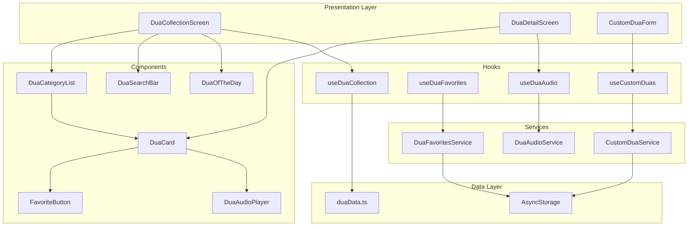

# Design Document: Dua Collection

## Overview

The Dua Collection feature extends the existing Azkar functionality to provide a comprehensive Islamic supplication library. The design follows the established React Native + Expo architecture, reusing existing patterns from the Azkar implementation while adding new capabilities for Quranic/Prophetic duas, favorites, custom duas, and audio playback.

## Architecture



## Components and Interfaces

### Data Types

```typescript
// types/dua.ts

export type DuaSource = 'quran' | 'hadith' | 'custom';
export type HadithGrade = 'sahih' | 'hasan' | 'daif';

export interface Dua {
  id: string;
  categoryId: string;
  textAr: string;
  transliteration: string;
  translation: string;
  source: DuaSource;
  // For Quranic duas
  surahNumber?: number;
  ayahNumber?: number;
  surahName?: string;
  // For Hadith duas
  hadithSource?: string;  // e.g., "Bukhari", "Muslim"
  hadithGrade?: HadithGrade;
  hadithNumber?: string;
  // Audio
  audioUrl?: string;
  hasAudio: boolean;
  // Metadata
  occasion?: string;
  benefits?: string;
  repetitions?: number;
}

export interface DuaCategory {
  id: string;
  titleAr: string;
  titleEn: string;
  icon: string;
  description?: string;
  subcategories?: DuaSubcategory[];
  count: number;
}

export interface DuaSubcategory {
  id: string;
  titleAr: string;
  titleEn: string;
  parentId: string;
}

export interface CustomDua {
  id: string;
  textAr?: string;
  transliteration?: string;
  translation: string;  // Required
  notes?: string;
  createdAt: number;
  updatedAt: number;
}

export interface DuaFavorite {
  duaId: string;
  addedAt: number;
}
```

### Screen Components

#### DuaCollectionScreen
Main screen displaying categories, search, and dua of the day.

```typescript
// screens/DuaCollectionScreen.tsx

interface DuaCollectionScreenProps {
  navigation: NativeStackNavigationProp<RootStackParamList>;
}

// Features:
// - Tab navigation: Categories | Quranic | Prophetic | Favorites | My Duas
// - Search bar with real-time filtering
// - Dua of the Day card
// - Category grid with icons and counts
```

#### DuaDetailScreen
Full dua view with audio player and actions.

```typescript
// screens/DuaDetailScreen.tsx

interface DuaDetailScreenProps {
  route: RouteProp<RootStackParamList, 'DuaDetail'>;
  navigation: NativeStackNavigationProp<RootStackParamList>;
}

// Features:
// - Full Arabic text with proper font
// - Transliteration
// - English translation
// - Source reference (tap to navigate for Quranic)
// - Audio player
// - Favorite toggle
// - Share button
```

#### CustomDuaFormScreen
Form for creating/editing custom duas.

```typescript
// screens/CustomDuaFormScreen.tsx

interface CustomDuaFormScreenProps {
  route: RouteProp<RootStackParamList, 'CustomDuaForm'>;
  navigation: NativeStackNavigationProp<RootStackParamList>;
}

// Features:
// - Arabic text input (optional)
// - Transliteration input (optional)
// - Translation/meaning input (required)
// - Personal notes input (optional)
// - Save/Cancel buttons
// - Edit mode for existing duas
```

### UI Components

#### DuaCard
Displays a single dua in list or detail view.

```typescript
// components/DuaCard.tsx

interface DuaCardProps {
  dua: Dua | CustomDua;
  variant: 'compact' | 'full';
  isFavorite?: boolean;
  onFavoriteToggle?: () => void;
  onPress?: () => void;
  onShare?: () => void;
  onPlayAudio?: () => void;
  isPlaying?: boolean;
}
```

#### DuaAudioPlayer
Audio playback controls for dua pronunciation.

```typescript
// components/DuaAudioPlayer.tsx

interface DuaAudioPlayerProps {
  audioUrl: string;
  duaId: string;
  onError?: (error: string) => void;
}

// Features:
// - Play/Pause button
// - Progress bar
// - Duration display
// - Loading state
// - Error handling
```

#### DuaOfTheDay
Featured dua card for the main screen.

```typescript
// components/DuaOfTheDay.tsx

interface DuaOfTheDayProps {
  onPress: () => void;
}

// Features:
// - Displays today's featured dua
// - Compact preview with Arabic and translation
// - Tap to view full dua
```

#### FavoriteButton
Toggle button for favoriting duas.

```typescript
// components/FavoriteButton.tsx

interface FavoriteButtonProps {
  isFavorite: boolean;
  onToggle: () => void;
  size?: number;
}
```

### Custom Hooks

#### useDuaCollection
Main hook for accessing dua data.

```typescript
// hooks/useDuaCollection.ts

interface UseDuaCollectionReturn {
  categories: DuaCategory[];
  quranicDuas: Dua[];
  propheticDuas: Dua[];
  getDuasByCategory: (categoryId: string) => Dua[];
  getDuaById: (id: string) => Dua | undefined;
  searchDuas: (query: string) => Dua[];
  duaOfTheDay: Dua;
  isLoading: boolean;
}
```

#### useDuaFavorites
Hook for managing favorites.

```typescript
// hooks/useDuaFavorites.ts

interface UseDuaFavoritesReturn {
  favorites: DuaFavorite[];
  favoriteDuas: Dua[];
  isFavorite: (duaId: string) => boolean;
  addFavorite: (duaId: string) => Promise<void>;
  removeFavorite: (duaId: string) => Promise<void>;
  toggleFavorite: (duaId: string) => Promise<void>;
  isLoading: boolean;
}
```

#### useCustomDuas
Hook for managing custom duas.

```typescript
// hooks/useCustomDuas.ts

interface UseCustomDuasReturn {
  customDuas: CustomDua[];
  addCustomDua: (dua: Omit<CustomDua, 'id' | 'createdAt' | 'updatedAt'>) => Promise<CustomDua>;
  updateCustomDua: (id: string, updates: Partial<CustomDua>) => Promise<void>;
  deleteCustomDua: (id: string) => Promise<void>;
  getCustomDuaById: (id: string) => CustomDua | undefined;
  isLoading: boolean;
}
```

#### useDuaAudio
Hook for audio playback.

```typescript
// hooks/useDuaAudio.ts

interface UseDuaAudioReturn {
  isPlaying: boolean;
  isLoading: boolean;
  currentDuaId: string | null;
  progress: number;
  duration: number;
  play: (duaId: string, audioUrl: string) => Promise<void>;
  pause: () => Promise<void>;
  stop: () => Promise<void>;
  seekTo: (position: number) => Promise<void>;
  error: string | null;
}
```

### Services

#### DuaFavoritesService
Manages favorite duas persistence.

```typescript
// services/DuaFavoritesService.ts

class DuaFavoritesService {
  private static STORAGE_KEY = '@dua_favorites';
  
  async getFavorites(): Promise<DuaFavorite[]>;
  async addFavorite(duaId: string): Promise<void>;
  async removeFavorite(duaId: string): Promise<void>;
  async isFavorite(duaId: string): Promise<boolean>;
  async clearAll(): Promise<void>;
}
```

#### CustomDuaService
Manages custom duas persistence.

```typescript
// services/CustomDuaService.ts

class CustomDuaService {
  private static STORAGE_KEY = '@custom_duas';
  
  async getAll(): Promise<CustomDua[]>;
  async getById(id: string): Promise<CustomDua | null>;
  async create(dua: Omit<CustomDua, 'id' | 'createdAt' | 'updatedAt'>): Promise<CustomDua>;
  async update(id: string, updates: Partial<CustomDua>): Promise<CustomDua>;
  async delete(id: string): Promise<void>;
}
```

#### DuaAudioService
Manages audio playback using expo-av.

```typescript
// services/DuaAudioService.ts

class DuaAudioService {
  private sound: Audio.Sound | null = null;
  
  async loadAndPlay(audioUrl: string): Promise<void>;
  async pause(): Promise<void>;
  async resume(): Promise<void>;
  async stop(): Promise<void>;
  async seekTo(positionMs: number): Promise<void>;
  async getStatus(): Promise<AVPlaybackStatus>;
  async unload(): Promise<void>;
  
  onPlaybackStatusUpdate(callback: (status: AVPlaybackStatus) => void): void;
}
```

## Data Models

### Dua Categories Structure

```typescript
// data/duaCategories.ts

export const duaCategories: DuaCategory[] = [
  { id: 'travel', titleEn: 'Travel', titleAr: 'السفر', icon: 'navigation', count: 12 },
  { id: 'eating', titleEn: 'Eating & Drinking', titleAr: 'الطعام والشراب', icon: 'coffee', count: 8 },
  { id: 'sleeping', titleEn: 'Sleeping & Waking', titleAr: 'النوم والاستيقاظ', icon: 'moon', count: 10 },
  { id: 'places', titleEn: 'Entering & Leaving', titleAr: 'الدخول والخروج', icon: 'home', count: 14 },
  { id: 'weather', titleEn: 'Weather & Nature', titleAr: 'الطقس والطبيعة', icon: 'cloud', count: 6 },
  { id: 'health', titleEn: 'Health & Healing', titleAr: 'الصحة والشفاء', icon: 'heart', count: 10 },
  { id: 'protection', titleEn: 'Protection', titleAr: 'الحماية', icon: 'shield', count: 15 },
  { id: 'gratitude', titleEn: 'Gratitude', titleAr: 'الشكر', icon: 'gift', count: 8 },
  { id: 'forgiveness', titleEn: 'Forgiveness', titleAr: 'الاستغفار', icon: 'refresh-cw', count: 12 },
  { id: 'guidance', titleEn: 'Guidance', titleAr: 'الهداية', icon: 'compass', count: 10 },
  { id: 'family', titleEn: 'Family & Children', titleAr: 'الأسرة والأولاد', icon: 'users', count: 8 },
  { id: 'general', titleEn: 'General', titleAr: 'عامة', icon: 'star', count: 20 },
];
```

### Sample Dua Data Structure

```typescript
// data/duaData.ts

export const quranicDuas: Dua[] = [
  {
    id: 'q1',
    categoryId: 'guidance',
    textAr: 'رَبَّنَا آتِنَا فِي الدُّنْيَا حَسَنَةً وَفِي الْآخِرَةِ حَسَنَةً وَقِنَا عَذَابَ النَّارِ',
    transliteration: 'Rabbana atina fid-dunya hasanatan wa fil-akhirati hasanatan wa qina adhaban-nar',
    translation: 'Our Lord, give us good in this world and good in the Hereafter, and protect us from the punishment of the Fire.',
    source: 'quran',
    surahNumber: 2,
    ayahNumber: 201,
    surahName: 'Al-Baqarah',
    hasAudio: true,
    audioUrl: 'https://example.com/audio/q1.mp3',
  },
  // ... more Quranic duas
];

export const propheticDuas: Dua[] = [
  {
    id: 'h1',
    categoryId: 'protection',
    textAr: 'بِسْمِ اللَّهِ الَّذِي لَا يَضُرُّ مَعَ اسْمِهِ شَيْءٌ فِي الْأَرْضِ وَلَا فِي السَّمَاءِ وَهُوَ السَّمِيعُ الْعَلِيمُ',
    transliteration: 'Bismillahil-ladhi la yadurru ma\'asmihi shay\'un fil-ardi wa la fis-sama\'i wa huwas-sami\'ul-\'alim',
    translation: 'In the name of Allah, with whose name nothing on earth or in heaven can cause harm, and He is the All-Hearing, the All-Knowing.',
    source: 'hadith',
    hadithSource: 'Abu Dawud & Tirmidhi',
    hadithGrade: 'sahih',
    repetitions: 3,
    hasAudio: true,
    audioUrl: 'https://example.com/audio/h1.mp3',
  },
  // ... more Prophetic duas
];
```

### Storage Schema

```typescript
// AsyncStorage Keys and Schemas

// Favorites: @dua_favorites
interface StoredFavorites {
  version: number;
  favorites: DuaFavorite[];
}

// Custom Duas: @custom_duas
interface StoredCustomDuas {
  version: number;
  duas: CustomDua[];
}
```

## Correctness Properties

*A property is a characteristic or behavior that should hold true across all valid executions of a system-essentially, a formal statement about what the system should do. Properties serve as the bridge between human-readable specifications and machine-verifiable correctness guarantees.*

### Property 1: Category Filtering Returns Only Matching Duas

*For any* category ID and the complete dua collection, when filtering duas by that category, all returned duas SHALL have a categoryId matching the selected category, and no duas with that categoryId SHALL be excluded.

**Validates: Requirements 1.2**

### Property 2: Dua Data Completeness

*For any* dua in the collection, the dua SHALL contain non-empty values for: textAr (Arabic text), transliteration, translation, and source reference.

**Validates: Requirements 1.4**

### Property 3: Quranic Dua Structure Validity

*For any* dua with source='quran', the dua SHALL contain valid surahNumber (1-114), ayahNumber (positive integer), and non-empty surahName.

**Validates: Requirements 2.2**

### Property 4: Prophetic Dua Source Validity

*For any* dua with source='hadith', the dua SHALL contain a non-empty hadithSource string identifying the hadith collection.

**Validates: Requirements 3.2, 3.3**

### Property 5: Favorites Toggle Consistency

*For any* dua ID, toggling favorite status SHALL change the isFavorite state: if the dua was not favorited, it becomes favorited; if it was favorited, it becomes unfavorited. The favorites list length SHALL change by exactly 1.

**Validates: Requirements 4.1, 4.2**

### Property 6: Favorites Persistence Round-Trip

*For any* set of favorite dua IDs, saving to storage and then loading from storage SHALL return an equivalent set of favorites (same dua IDs, order may differ).

**Validates: Requirements 4.5, 4.6**

### Property 7: Custom Dua Persistence Round-Trip

*For any* valid custom dua (with required translation field), creating the dua and then retrieving it by ID SHALL return a dua with equivalent content (textAr, transliteration, translation, notes).

**Validates: Requirements 5.2, 5.6**

### Property 8: Custom Dua Deletion Removes From Storage

*For any* custom dua that exists in storage, deleting it SHALL result in the dua no longer being retrievable, and the total count of custom duas SHALL decrease by 1.

**Validates: Requirements 5.5**

### Property 9: Audio Availability Indicator

*For any* dua, the hasAudio property SHALL be true if and only if audioUrl is a non-empty string.

**Validates: Requirements 6.1**

### Property 10: Search Results Match Query

*For any* non-empty search query and the complete dua collection, all returned duas SHALL contain the query string (case-insensitive) in at least one of: textAr, transliteration, translation, or category name. No matching duas SHALL be excluded from results.

**Validates: Requirements 7.2, 7.3**

### Property 11: Dua of the Day Determinism

*For any* date, calling the getDuaOfTheDay function multiple times with the same date SHALL return the same dua. Different dates MAY return different duas.

**Validates: Requirements 8.2, 8.4**

### Property 12: Share Content Completeness

*For any* dua, the formatted share string SHALL contain the dua's Arabic text, transliteration, translation, source reference, and app attribution text.

**Validates: Requirements 9.2, 9.3**

## Error Handling

### Storage Errors
- **AsyncStorage failures**: Wrap all storage operations in try-catch, show user-friendly error toast, log error for debugging
- **Corrupted data**: Validate data structure on load, reset to defaults if invalid with user notification
- **Storage quota exceeded**: Check available space before large operations, prompt user to clear data if needed

### Audio Errors
- **Network failures**: Show offline indicator, disable play button for non-cached audio
- **Invalid audio URL**: Display "Audio unavailable" message, hide play button
- **Playback interruption**: Handle audio focus loss gracefully, allow resume
- **Codec issues**: Catch playback errors, show generic error message

### Navigation Errors
- **Invalid dua ID**: Show "Dua not found" screen with back navigation
- **Invalid Quran reference**: Validate surah/ayah before navigation, show error if invalid

### Form Validation Errors
- **Empty required field**: Highlight field, show inline error message
- **Invalid input**: Sanitize input, show validation feedback

## Testing Strategy

### Unit Tests
Unit tests verify specific examples and edge cases:

1. **Data validation tests**
   - Verify all bundled duas have required fields
   - Verify Quranic duas have valid surah/ayah references
   - Verify category counts match actual dua counts

2. **Service tests**
   - DuaFavoritesService: add, remove, toggle, clear operations
   - CustomDuaService: CRUD operations, validation
   - Search function: exact matches, partial matches, no matches

3. **Edge case tests**
   - Empty favorites list rendering
   - Empty search results
   - Custom dua with only required field
   - Audio unavailable state

### Property-Based Tests
Property-based tests verify universal properties across generated inputs using fast-check:

1. **Property 1**: Generate random category IDs, verify filtering correctness
2. **Property 5**: Generate sequences of toggle operations, verify state consistency
3. **Property 6**: Generate random favorite sets, verify persistence round-trip
4. **Property 7**: Generate random custom duas, verify persistence round-trip
5. **Property 10**: Generate random search queries, verify result correctness
6. **Property 11**: Generate random dates, verify deterministic selection
7. **Property 12**: Generate random duas, verify share format completeness

### Testing Configuration
- **Framework**: Jest with React Native Testing Library
- **Property testing**: fast-check library
- **Minimum iterations**: 100 per property test
- **Tag format**: `Feature: dua-collection, Property {number}: {property_text}`

### Integration Tests
- Navigation flow from category to dua detail
- Favorite toggle updates across screens
- Audio playback lifecycle
- Share sheet integration

