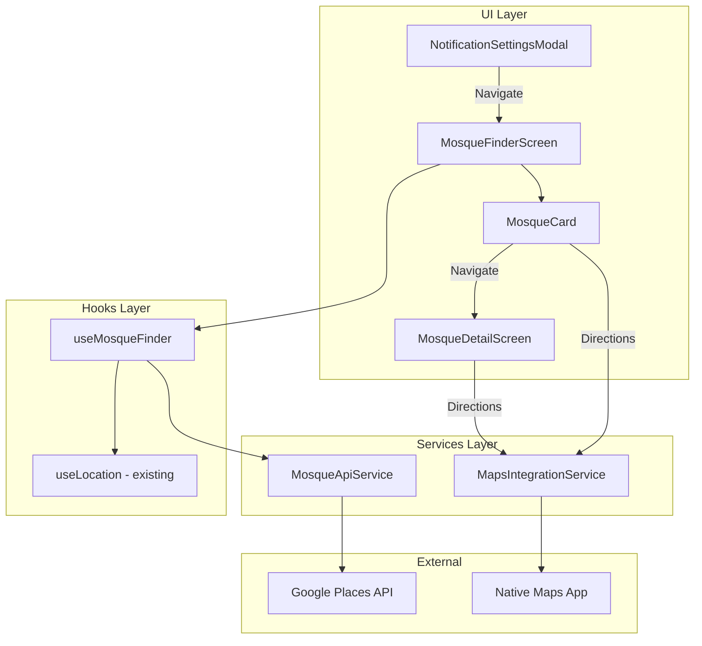

# Design Document: Mosque Finder

## Overview

The Mosque Finder feature allows users to discover nearby mosques using their GPS location, view detailed information about each mosque, and get directions. The feature integrates with Google Places API for mosque discovery and uses native maps applications for navigation. A quick-access button is added to the Iqama settings section to provide contextual entry to the feature.

## Architecture



## Components and Interfaces

### MosqueFinderScreen

Main screen displaying list of nearby mosques with search and filter capabilities.

```typescript
interface MosqueFinderScreenProps {
  // No props - uses hooks for data
}

// Screen features:
// - Search input at top
// - Radius filter dropdown
// - List of MosqueCard components
// - Loading/error/empty states
```

### MosqueDetailScreen

Detail screen showing full mosque information.

```typescript
interface MosqueDetailScreenProps {
  route: {
    params: {
      mosqueId: string;
      mosque?: Mosque; // Optional pre-loaded data
    };
  };
}
```

### MosqueCard

Compact card component for mosque list items.

```typescript
interface MosqueCardProps {
  mosque: Mosque;
  onPress: () => void;
  onDirections: () => void;
}
```

### useMosqueFinder Hook

Custom hook managing mosque discovery state and API calls.

```typescript
interface UseMosqueFinderReturn {
  mosques: Mosque[];
  isLoading: boolean;
  error: string | null;
  searchQuery: string;
  setSearchQuery: (query: string) => void;
  radius: number;
  setRadius: (radius: number) => void;
  refetch: () => void;
  filteredMosques: Mosque[]; // Filtered by search query
}
```

### MosqueApiService

Service for interacting with Google Places API.

```typescript
interface MosqueApiService {
  searchNearbyMosques(
    latitude: number,
    longitude: number,
    radiusMeters: number
  ): Promise<Mosque[]>;
  
  getMosqueDetails(placeId: string): Promise<MosqueDetail>;
}
```

### MapsIntegrationService

Service for opening native maps applications.

```typescript
interface MapsIntegrationService {
  openDirections(
    destination: { latitude: number; longitude: number; name: string }
  ): Promise<void>;
  
  getMapsUrl(
    destination: { latitude: number; longitude: number; name: string },
    platform: 'ios' | 'android'
  ): string;
}
```

## Data Models

### Mosque

```typescript
interface Mosque {
  id: string;           // Google Place ID
  name: string;
  address: string;
  latitude: number;
  longitude: number;
  distance: number;     // Distance from user in meters
  rating?: number;      // 1-5 rating
  reviewCount?: number;
  isOpen?: boolean;     // Current open/closed status
  photoReference?: string; // For fetching photo
}
```

### MosqueDetail

```typescript
interface MosqueDetail extends Mosque {
  phoneNumber?: string;
  website?: string;
  photos: string[];     // Array of photo URLs
  openingHours?: {
    weekdayText: string[];  // e.g., ["Monday: 5:00 AM – 10:00 PM", ...]
    isOpenNow: boolean;
  };
}
```

### Radius Options

```typescript
const RADIUS_OPTIONS = [
  { label: '1 km', value: 1000 },
  { label: '5 km', value: 5000 },
  { label: '10 km', value: 10000 },
  { label: '25 km', value: 25000 },
] as const;

const DEFAULT_RADIUS = 5000; // 5km
```

## Correctness Properties

*A property is a characteristic or behavior that should hold true across all valid executions of a system—essentially, a formal statement about what the system should do. Properties serve as the bridge between human-readable specifications and machine-verifiable correctness guarantees.*

### Property 1: Mosque List Sorted by Distance

*For any* list of mosques returned from the API, the displayed list SHALL be sorted in ascending order by distance from the user's location.

**Validates: Requirements 1.3**

### Property 2: Search Filter Correctness

*For any* search query string and list of mosques, the filtered results SHALL only contain mosques whose names include the search query (case-insensitive).

**Validates: Requirements 5.2**

### Property 3: Mosque Card Data Completeness

*For any* mosque data object, the rendered MosqueCard SHALL display the mosque name, formatted distance, and rating (if rating exists).

**Validates: Requirements 1.4**

### Property 4: Mosque Detail Data Completeness

*For any* mosque detail data object, the rendered MosqueDetailScreen SHALL display all available fields (name, address, phone if exists, website if exists, photos if exist, hours if exist).

**Validates: Requirements 2.2, 2.3, 2.4, 2.5**

### Property 5: Maps URL Generation

*For any* mosque with valid coordinates and any supported platform (iOS/Android), the generated maps URL SHALL contain the correct latitude, longitude, and use the platform-appropriate URL scheme (maps:// for iOS, geo: for Android).

**Validates: Requirements 3.2, 3.3**

### Property 6: Radius Filter Updates Query

*For any* radius value change, the API service SHALL be called with the new radius parameter.

**Validates: Requirements 5.4**

### Property 7: Find Mosques Button Visibility

*For any* iqama enabled/disabled state, the "Find Nearby Mosques" button SHALL be visible in the NotificationSettingsModal.

**Validates: Requirements 4.3**

## Error Handling

### Location Permission Denied
- Display informative message explaining location is needed
- Show button to open device settings
- Do not crash or show empty screen

### API Errors
- Display user-friendly error message
- Provide "Retry" button
- Log error details for debugging

### No Results
- Display helpful message: "No mosques found within {radius}"
- Suggest expanding search radius
- Provide quick-action buttons to change radius

### Offline State
- Detect network status using NetInfo
- Display offline indicator
- Provide "Retry" button
- Do not cache mosque data (always fetch fresh)

### Maps App Not Available
- Catch linking error
- Display toast/alert with error message
- Suggest alternative (copy address to clipboard)

## Testing Strategy

### Unit Tests
- MosqueApiService: Mock API responses, test parsing
- MapsIntegrationService: Test URL generation for both platforms
- useMosqueFinder: Test state management, filtering logic
- Distance formatting utility functions

### Property-Based Tests
- **Property 1**: Generate random mosque lists, verify sorting
- **Property 2**: Generate random queries and mosque names, verify filtering
- **Property 3**: Generate random mosque data, verify card rendering
- **Property 5**: Generate random coordinates, verify URL format

### Integration Tests
- Full flow: Open screen → Load mosques → Tap card → View details
- Search flow: Type query → Verify filtered results
- Directions flow: Tap directions → Verify maps app opens

### Manual Testing
- Test on physical devices for location accuracy
- Test with various network conditions
- Test maps integration on both iOS and Android
