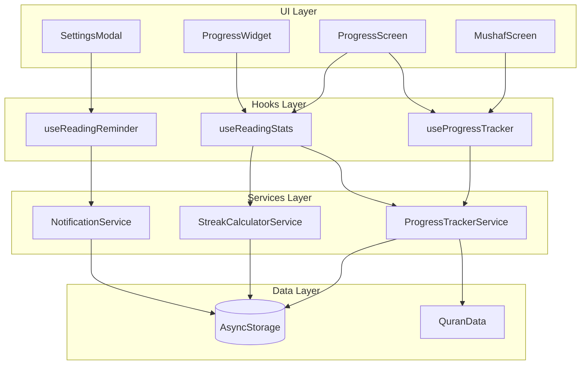

# Design Document: Quran Reading Progress & Khatm Tracker

## Overview

The Quran Reading Progress & Khatm Tracker integrates with the existing MushafScreen to automatically track reading progress, manage daily goals, maintain reading streaks, and count Khatm completions. The system uses local storage (AsyncStorage) for persistence and leverages the existing notification infrastructure for reading reminders.

## Architecture



## Components and Interfaces

### Data Types

```typescript
// Core progress data structure
interface ReadingProgress {
  pagesRead: Record<number, PageReadData>;  // page number -> read data
  dailyGoal: DailyGoal;
  streak: StreakData;
  khatmHistory: KhatmRecord[];
  settings: ProgressSettings;
}

interface PageReadData {
  firstReadAt: number;      // timestamp of first read
  lastReadAt: number;       // timestamp of most recent read
  readCount: number;        // how many times this page was read
}

interface DailyGoal {
  type: 'pages' | 'verses';
  target: number;           // 1-20 for pages, 1-100 for verses
  enabled: boolean;
}

interface StreakData {
  currentStreak: number;
  longestStreak: number;
  lastGoalMetDate: string;  // ISO date string (YYYY-MM-DD)
  streakHistory: DailyRecord[];
}

interface DailyRecord {
  date: string;             // ISO date string
  pagesRead: number;
  versesRead: number;
  goalMet: boolean;
}

interface KhatmRecord {
  completedAt: number;      // timestamp
  durationDays: number;     // days taken to complete
  startedAt: number;        // timestamp when this khatm cycle started
}

interface ProgressSettings {
  reminderEnabled: boolean;
  reminderTime: string;     // HH:MM format
  trackingEnabled: boolean;
}
```

### ProgressTrackerService

```typescript
class ProgressTrackerService {
  // Storage key
  private static STORAGE_KEY = '@quran_reading_progress';
  
  // Load progress from storage
  async loadProgress(): Promise<ReadingProgress>;
  
  // Save progress to storage
  async saveProgress(progress: ReadingProgress): Promise<void>;
  
  // Mark a page as read
  async markPageRead(pageNumber: number): Promise<ReadingProgress>;
  
  // Update daily goal
  async setDailyGoal(goal: DailyGoal): Promise<void>;
  
  // Check and update streak
  async updateStreak(progress: ReadingProgress): Promise<StreakData>;
  
  // Check for Khatm completion
  async checkKhatmCompletion(progress: ReadingProgress): Promise<boolean>;
  
  // Reset progress for new Khatm cycle
  async startNewKhatmCycle(): Promise<ReadingProgress>;
  
  // Validate progress data structure
  validateProgress(data: unknown): ReadingProgress | null;
  
  // Get default progress
  getDefaultProgress(): ReadingProgress;
}
```

### ProgressCalculator

```typescript
class ProgressCalculator {
  // Calculate total pages read
  static getTotalPagesRead(progress: ReadingProgress): number;
  
  // Calculate completion percentage
  static getCompletionPercentage(progress: ReadingProgress): number;
  
  // Calculate verses read based on pages
  static getVersesRead(pagesRead: number[]): number;
  
  // Calculate Juz completion
  static getJuzCompletion(pagesRead: number[]): JuzStatus[];
  
  // Calculate today's progress
  static getTodayProgress(progress: ReadingProgress): DailyProgress;
  
  // Calculate remaining for daily goal
  static getRemainingForGoal(progress: ReadingProgress): number;
  
  // Get weekly reading data
  static getWeeklyData(progress: ReadingProgress): WeeklyData;
}

interface JuzStatus {
  juzNumber: number;
  pagesRead: number;
  totalPages: number;
  isComplete: boolean;
}

interface DailyProgress {
  pagesRead: number;
  versesRead: number;
  goalProgress: number;  // 0-100 percentage
  goalMet: boolean;
}

interface WeeklyData {
  days: Array<{
    date: string;
    pagesRead: number;
    goalMet: boolean;
  }>;
  totalPages: number;
  averagePerDay: number;
}
```

### useProgressTracker Hook

```typescript
function useProgressTracker() {
  // State
  const [progress, setProgress] = useState<ReadingProgress | null>(null);
  const [loading, setLoading] = useState(true);
  
  // Actions
  const markPageRead: (pageNumber: number) => Promise<void>;
  const setDailyGoal: (goal: DailyGoal) => Promise<void>;
  const resetProgress: () => Promise<void>;
  
  // Computed values
  const stats: ReadingStats;
  const todayProgress: DailyProgress;
  const isGoalMet: boolean;
  
  return { progress, loading, markPageRead, setDailyGoal, resetProgress, stats, todayProgress, isGoalMet };
}
```

## Data Models

### Quran Structure Constants

```typescript
const QURAN_CONSTANTS = {
  TOTAL_PAGES: 604,
  TOTAL_VERSES: 6236,
  TOTAL_JUZ: 30,
  PAGES_PER_JUZ: 20.13,  // approximate
  
  // Juz to page mapping (start page of each Juz)
  JUZ_START_PAGES: [1, 22, 42, 62, 82, 102, 121, 142, 162, 182, 
                   201, 222, 242, 262, 282, 302, 322, 342, 362, 382,
                   402, 422, 442, 462, 482, 502, 522, 542, 562, 582],
};

// Page to verse count mapping (approximate verses per page)
const PAGE_VERSE_COUNTS: Record<number, number>;
```

### Storage Schema

```json
{
  "pagesRead": {
    "1": { "firstReadAt": 1704067200000, "lastReadAt": 1704153600000, "readCount": 2 },
    "2": { "firstReadAt": 1704067200000, "lastReadAt": 1704067200000, "readCount": 1 }
  },
  "dailyGoal": {
    "type": "pages",
    "target": 5,
    "enabled": true
  },
  "streak": {
    "currentStreak": 7,
    "longestStreak": 14,
    "lastGoalMetDate": "2024-01-15",
    "streakHistory": [
      { "date": "2024-01-15", "pagesRead": 6, "versesRead": 45, "goalMet": true }
    ]
  },
  "khatmHistory": [
    { "completedAt": 1703980800000, "durationDays": 120, "startedAt": 1693612800000 }
  ],
  "settings": {
    "reminderEnabled": true,
    "reminderTime": "20:00",
    "trackingEnabled": true
  }
}
```

## Correctness Properties

*A property is a characteristic or behavior that should hold true across all valid executions of a system—essentially, a formal statement about what the system should do. Properties serve as the bridge between human-readable specifications and machine-verifiable correctness guarantees.*

### Property 1: Page Reading Records and Persists Data

*For any* valid page number (1-604), when marked as read, the Progress_Tracker should record the page in pagesRead, set a valid timestamp, and persist to storage such that reloading returns the same data.

**Validates: Requirements 1.1, 1.2, 1.5**

### Property 2: Progress Calculation Correctness

*For any* set of read pages, the Progress_Calculator should return:
- Total pages read equal to the set size
- Completion percentage equal to (set size / 604) * 100
- Verses read equal to the sum of verses on those pages
- Juz completion status correctly reflecting which Juz have all pages read

**Validates: Requirements 2.1, 2.2, 2.3, 2.4, 7.4**

### Property 3: Daily Goal Validation

*For any* goal setting attempt:
- Page goals must be in range 1-20 (inclusive)
- Verse goals must be in range 1-100 (inclusive)
- Goals outside these ranges should be rejected

**Validates: Requirements 3.1, 3.2**

### Property 4: Goal Persistence Round-Trip

*For any* valid daily goal, setting the goal and then reloading from storage should return an equivalent goal object.

**Validates: Requirements 3.3**

### Property 5: Streak State Machine

*For any* sequence of daily reading sessions:
- Meeting the goal should increment currentStreak by 1
- Missing the goal (no reading or below target) should reset currentStreak to 0
- longestStreak should always be >= currentStreak
- longestStreak should equal the maximum streak ever achieved

**Validates: Requirements 4.1, 4.2, 4.3, 4.5**

### Property 6: Khatm Completion Logic

*For any* progress state where all 604 pages are marked as read:
- A new KhatmRecord should be added to khatmHistory
- The khatmHistory length should equal the total Khatm count
- After completion, pagesRead should be reset (empty or cleared)
- The completion date should be recorded in the KhatmRecord

**Validates: Requirements 5.1, 5.2, 5.3, 5.4**

### Property 7: Notification Remaining Calculation

*For any* daily goal and current day's reading progress, the remaining amount should equal max(0, goal.target - todayProgress).

**Validates: Requirements 6.4**

### Property 8: Progress Data Round-Trip

*For any* valid ReadingProgress object, serializing to JSON and deserializing should produce an equivalent object.

**Validates: Requirements 1.3, 8.1**

### Property 9: Data Validation and Error Handling

*For any* corrupted or invalid data loaded from storage:
- The validator should return null or throw
- The system should fall back to default progress values
- The default progress should have empty pagesRead, zero streaks, and empty khatmHistory

**Validates: Requirements 8.3, 8.4**

## Error Handling

### Storage Errors

- **Read Failure**: If AsyncStorage read fails, initialize with default progress and log error
- **Write Failure**: If AsyncStorage write fails, retry once, then show user-friendly error message
- **Corruption**: If data validation fails, backup corrupted data, reset to defaults, notify user

### Calculation Errors

- **Invalid Page Number**: Reject page numbers outside 1-604 range
- **Invalid Goal**: Reject goals outside valid ranges with descriptive error
- **Date Parsing**: Use ISO 8601 format consistently, handle timezone issues

### Notification Errors

- **Permission Denied**: Gracefully disable reminders, prompt user to enable in settings
- **Scheduling Failure**: Log error, retry on next app open

## Testing Strategy

### Unit Tests

Unit tests will verify specific examples and edge cases:

- Page boundary cases (page 1, page 604)
- Goal boundary cases (min/max values)
- Streak edge cases (first day, streak break, streak continuation)
- Khatm completion edge case (reading page 604 last)
- Empty progress state handling
- Corrupted data recovery

### Property-Based Tests

Property-based tests will use fast-check to verify universal properties across many generated inputs:

- **Framework**: fast-check (TypeScript property-based testing library)
- **Minimum iterations**: 100 per property
- **Generators**: Custom generators for ReadingProgress, page sets, goal configurations

Each property test will be tagged with:
```typescript
// Feature: quran-progress-tracker, Property N: [property description]
```

### Integration Tests

- MushafScreen integration with progress tracking
- Notification scheduling with reading reminders
- AsyncStorage persistence across app restarts
