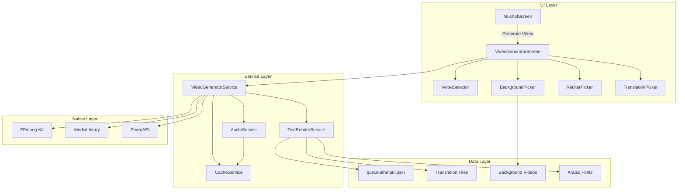

# Design Document: Quran Video Generator

## Overview

This feature enables on-device video generation for Quran verses using FFmpeg-kit. Users can create shareable videos with Arabic text, translations, background videos, and audio recitation - all processed locally on iOS/Android without requiring a server.

The architecture follows a modular approach with separate services for video generation, audio management, and text rendering, coordinated by a central VideoGeneratorService.

## Architecture



## Components and Interfaces

### VideoGeneratorService

The core orchestrator that coordinates video generation.

```typescript
interface VideoGeneratorConfig {
  surah: number;
  ayahStart: number;
  ayahEnd: number;
  reciterId: string;
  translationId: string | null;
  backgroundFilename: string;
  orientation: 'portrait' | 'landscape' | 'square';
  resolution: '720p' | '1080p';
  textColor: string;
}

interface VideoGeneratorService {
  // Generate video with given configuration
  generateVideo(config: VideoGeneratorConfig): Promise<GenerationResult>;
  
  // Cancel ongoing generation
  cancelGeneration(): void;
  
  // Get generation progress (0-100)
  onProgress(callback: (progress: number) => void): void;
  
  // Clean up temporary files
  cleanup(): Promise<void>;
}

interface GenerationResult {
  success: boolean;
  videoPath?: string;
  fileSize?: number;
  duration?: number;
  error?: string;
}
```

### AudioService

Handles downloading and caching verse audio.

```typescript
interface AudioService {
  // Download audio for verse range
  downloadAudio(
    surah: number, 
    ayahStart: number, 
    ayahEnd: number, 
    reciterId: string
  ): Promise<AudioResult>;
  
  // Get cached audio if available
  getCachedAudio(surah: number, ayah: number, reciterId: string): string | null;
  
  // Get audio duration
  getAudioDuration(audioPath: string): Promise<number>;
  
  // Concatenate multiple audio files
  concatenateAudio(audioPaths: string[]): Promise<string>;
}

interface AudioResult {
  path: string;
  duration: number;
  cached: boolean;
}
```

### TextRenderService

Handles text layout calculations and image generation.

```typescript
interface TextRenderService {
  // Calculate optimal text layout
  calculateLayout(
    arabicText: string,
    translationText: string | null,
    videoWidth: number,
    videoHeight: number
  ): TextLayout;
  
  // Generate text overlay image
  generateTextOverlay(
    layout: TextLayout,
    textColor: string
  ): Promise<string>; // Returns path to PNG
}

interface TextLayout {
  arabicFontSize: number;
  arabicLines: string[];
  arabicY: number;
  translationFontSize: number;
  translationLines: string[];
  translationY: number;
  overlayBounds: { x: number; y: number; width: number; height: number };
}
```

### CacheService

Manages caching of audio files and generated assets.

```typescript
interface CacheService {
  // Get cache directory path
  getCacheDir(): string;
  
  // Check if file exists in cache
  exists(key: string): boolean;
  
  // Get cached file path
  get(key: string): string | null;
  
  // Save file to cache
  set(key: string, sourcePath: string): Promise<string>;
  
  // Clear all cache
  clearAll(): Promise<void>;
  
  // Get cache size in bytes
  getCacheSize(): Promise<number>;
}
```

## Data Models

### Reciter

```typescript
interface Reciter {
  id: string;           // e.g., 'alafasy'
  name: string;         // e.g., 'Mishary Rashid Alafasy'
  nameAr: string;       // e.g., 'مشاري راشد العفاسي'
  directory: string;    // e.g., 'Alafasy_128kbps' (for everyayah.com)
}
```

### Translation

```typescript
interface Translation {
  id: string;           // e.g., 'en_sahih'
  name: string;         // e.g., 'Sahih International'
  language: string;     // e.g., 'English'
  languageCode: string; // e.g., 'en'
  filename: string;     // e.g., 'en.sahih.json'
  fontFamily: string;   // Font to use for this language
}
```

### BackgroundVideo

```typescript
interface BackgroundVideo {
  filename: string;     // e.g., 'nature_1.mp4'
  displayName: string;  // e.g., 'Nature Scene'
  thumbnailUri: string; // Local asset URI
  supportedOrientations: ('portrait' | 'landscape' | 'square')[];
}
```

### VideoGenerationState

```typescript
interface VideoGenerationState {
  status: 'idle' | 'downloading' | 'rendering' | 'encoding' | 'complete' | 'error';
  progress: number;     // 0-100
  currentStep: string;  // Human-readable step description
  estimatedTimeRemaining?: number; // seconds
  error?: string;
}
```

## Correctness Properties

*A property is a characteristic or behavior that should hold true across all valid executions of a system - essentially, a formal statement about what the system should do. Properties serve as the bridge between human-readable specifications and machine-verifiable correctness guarantees.*

### Property 1: Verse Range Validation
*For any* selected verse range (ayahStart, ayahEnd), the difference (ayahEnd - ayahStart) SHALL be less than or equal to 1, ensuring maximum 2 verses.
**Validates: Requirements 1.4**

### Property 2: Verse Data Integrity
*For any* surah number (1-114), the Verse_Selector SHALL return the correct number of ayahs matching the Quran data, and the Arabic text SHALL match the quran-uthmani.json source.
**Validates: Requirements 1.1, 1.2, 1.5**

### Property 3: Audio URL Construction
*For any* valid surah, ayah, and reciter combination, the constructed everyayah.com URL SHALL follow the format `https://everyayah.com/data/{reciterDirectory}/{surah:03d}{ayah:03d}.mp3`.
**Validates: Requirements 3.2**

### Property 4: Audio Caching Round-Trip
*For any* downloaded audio file, saving to cache and retrieving SHALL return the same file path, and the file SHALL exist at that path.
**Validates: Requirements 3.4**

### Property 5: Text Positioning
*For any* video dimensions and text content, the Arabic text SHALL be horizontally centered (x = videoWidth/2), and the translation text Y position SHALL be greater than (arabicY + arabicBlockHeight + gap).
**Validates: Requirements 5.2, 5.3**

### Property 6: Video Duration Sync
*For any* generated video, the video duration SHALL equal the total audio duration (within 0.5 second tolerance).
**Validates: Requirements 5.4**

### Property 7: Text Wrapping
*For any* text string and maximum width, the wrapped lines SHALL each have a rendered width less than or equal to maxWidth.
**Validates: Requirements 6.2**

### Property 8: Font Size Optimization
*For any* text content and video dimensions, the calculated font size SHALL result in text that fits within the designated text area (height <= maxTextHeight).
**Validates: Requirements 6.3**

### Property 9: Resolution Output
*For any* selected resolution (720p or 1080p) and orientation, the output video dimensions SHALL match the expected values (e.g., 1080p portrait = 1080x1920).
**Validates: Requirements 7.3**

### Property 10: Orientation Scaling
*For any* orientation selection, the output video aspect ratio SHALL match the expected ratio (portrait=9:16, landscape=16:9, square=1:1).
**Validates: Requirements 2.5**

### Property 11: Auto-Population from Mushaf
*For any* verse selected in Mushaf screen, navigating to Video Generator SHALL result in surah and ayah fields matching the selected verse exactly.
**Validates: Requirements 11.3, 11.4**

### Property 12: Cleanup After Error
*For any* failed video generation, the temporary files directory SHALL be empty after cleanup is called.
**Validates: Requirements 10.4**

### Property 13: File Size Calculation
*For any* generated video, the displayed file size SHALL match the actual file size on disk (within 1KB tolerance).
**Validates: Requirements 8.4**

## Error Handling

### Network Errors
- Audio download failures: Retry up to 3 times with exponential backoff
- Timeout after 30 seconds per audio file
- Offer "Generate without audio" option on persistent failure

### Storage Errors
- Check available storage before generation (require 2x estimated output size)
- Display clear message with required space
- Suggest clearing cache if insufficient

### FFmpeg Errors
- Log full FFmpeg output for debugging
- Parse common error codes for user-friendly messages
- Clean up partial output files on failure

### Memory Errors
- Monitor memory usage during generation
- Use streaming where possible to reduce memory footprint
- Abort gracefully if memory pressure detected

## Testing Strategy

### Unit Tests
- Text wrapping algorithm with various text lengths
- Font size calculation with edge cases
- Audio URL construction for all reciters
- Cache key generation and retrieval
- Verse range validation

### Property-Based Tests
Using fast-check for React Native:
- Verse data integrity across all surahs
- Text positioning calculations
- Resolution/orientation output dimensions
- Auto-population parameter passing

### Integration Tests
- Full video generation flow (mocked FFmpeg)
- Audio download and caching
- Share intent triggering
- Media library saving

### Manual Tests
- Visual verification of text rendering
- Audio sync verification
- Performance on various devices
- Share to different apps (WhatsApp, Instagram, etc.)
